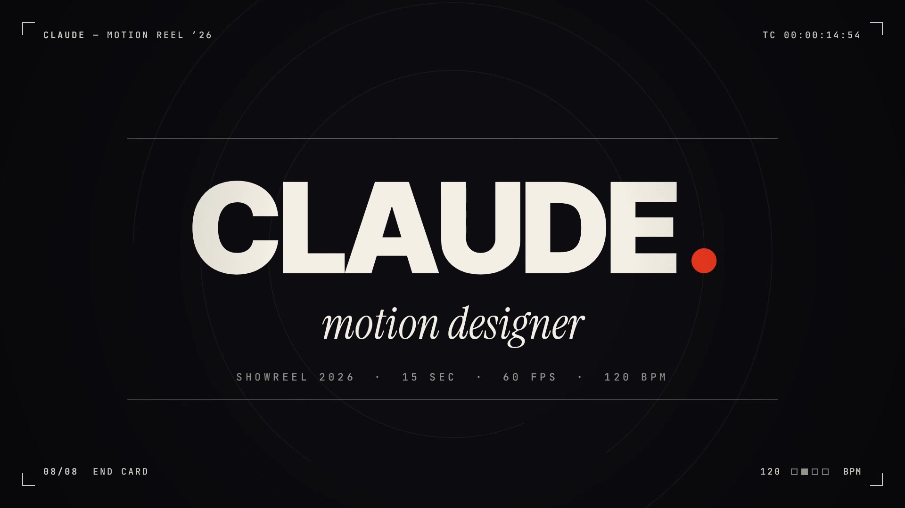

# Claude — Motion Reel 2026



15秒・1920×1080・60fps のショーリールです。完成品は `showreel.mp4`。

120BPM（1拍0.5秒、1小節2秒）に合わせて、2秒ごとに場面が変わります。

| 時間 | 場面 | 内容 |
|---|---|---|
| 0–2s | IGNITION | 点が線に伸び、2本に割れて「SHOWREEL」。Oの中をオレンジで満たし、そのままOの中へズーム |
| 2–4s | PRINCIPLES | 1拍ごとに TIMING / SPACING / WEIGHT / RHYTHM。文字ごとのバネ、イージングの間隔図、着地のつぶれ、逆方向に流れる行 |
| 4–6s | SHAPE MORPH | 円→四角→三角→星を拍の頭でモーフ。残像、衝撃波リング、軌道を回る衛星。最後は一点に縮む |
| 6–8s | PARTICLES | その一点から3,000粒が弾け、渦を巻いて「MOTION」に集まり、風で右へ飛ぶ |
| 8–10s | DIMENSION | 3Dの点群。フィボナッチ球がトレフォイル結び目に変わり、カメラが中へ突っ込む |
| 10–12s | INTERFACE | UIカード、棒グラフ、ドーナツ、カウンター。カーソルが RENDER を押し、波紋が次の場面になる |
| 12–14s | MONTAGE | 0.25秒→0.125秒→0.0625秒と詰まっていくカット。メタボール、グリッチ、ハーフトーンなど |
| 14–15s | END CARD | 一拍の無音のあとにヒット。「CLAUDE.」のピリオドは冒頭の点と同じもの |

## 作り方

絵はすべて `showreel.html` の Canvas 2D で描いています。どのフレームも時刻 `t` だけで決まるので、途中の1枚だけを描き出すこともでき、書き出しは並列で回せます。

- モーションブラー: 1フレームにつき10サンプル（180°シャッター相当）を float16 のバッファで平均
- 音: `audio.py` が numpy/scipy でキック、ベース、パッド、ライザー、効果音を合成。場面転換の時刻は映像と同じ値を使っています
- 書き出し: `render.mjs` が Chromium を4枚並べてPNGを作り、順番どおり ffmpeg（H.264 + AAC）に流します

## 書き出し直す

```sh
pip install numpy scipy imageio-ffmpeg
python3 audio.py                        # showreel-audio.wav を作る
FFMPEG=$(python3 -c "import imageio_ffmpeg as i; print(i.get_ffmpeg_exe())") \
  node render.mjs                       # showreel.mp4（4コアで約2分半）
node render.mjs --stills 3.1,7.5        # 指定時刻の静止画を stills/ に
```

`showreel.html` をブラウザで開いてクリックすると、その場で再生されます（ブラーなしのプレビュー）。`?t=7.5` を付けると、その時刻の1枚をブラー付きで表示します。

フォントは Inter Tight / JetBrains Mono / Instrument Serif（いずれも SIL Open Font License）を `fonts/` に同梱しています。
